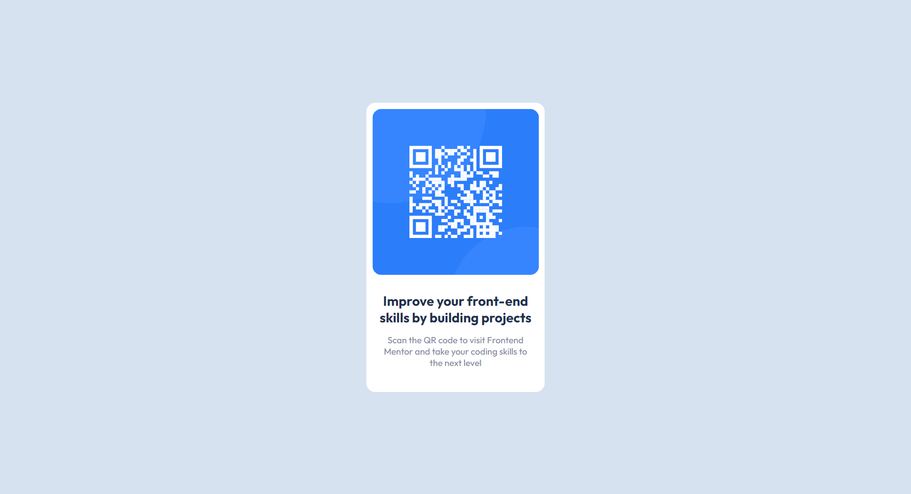

# Frontend Mentor - QR code component solution

This is a solution to the [QR code component challenge on Frontend Mentor](https://www.frontendmentor.io/challenges/qr-code-component-iux_sIO_H). Frontend Mentor challenges help you improve your coding skills by building realistic projects. 

## Table of contents

- [Overview](#overview)
  - [Screenshot](#screenshot)
  - [Links](#links)
- [My process](#my-process)
  - [Built with](#built-with)
  - [What I learned](#what-i-learned)
- [Author](#author)

**Note: Delete this note and update the table of contents based on what sections you keep.**

## Overview

### Screenshot



### Links

- Solution URL: (https://github.com/Poonamkothawade25/qr-code-assgn)
- Live Site URL: (https://poonamkothawade25.github.io/qr-code-assgn/)

## My process

### Built with

- Semantic HTML5 markup
- CSS custom properties
- CSS position and transform properties
- Desktop-first workflow

### What I learned

I learned how to center a div element. I learned about various methods to center a div but I decided to use below method in this challenge.

```css
.proud-of-this-css {
  position: absolute;
  top: 50%;
  left: 50%;
  transform: translate(-50%, -50%);
}
```

## Author

- Frontend Mentor - [@Poonamkothawade25](https://www.frontendmentor.io/profile/Poonamkothawade25)
